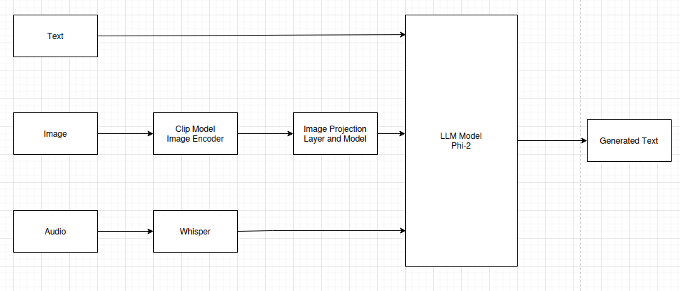
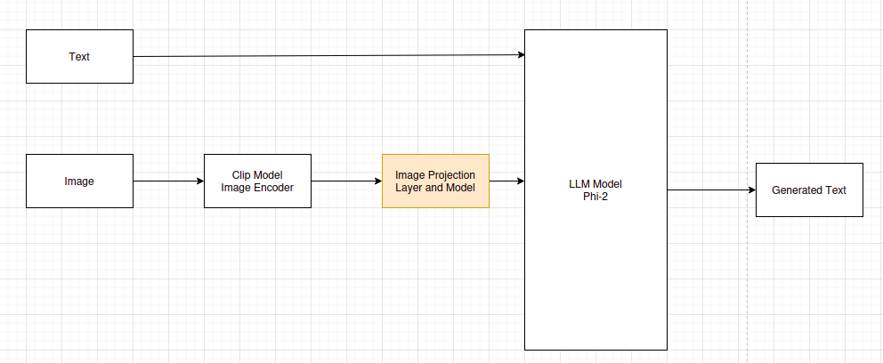
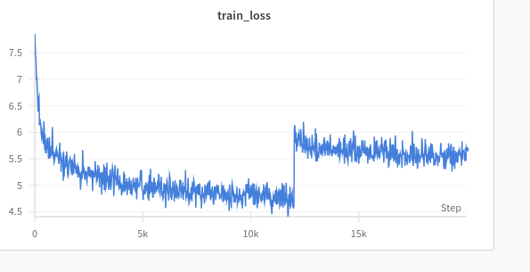
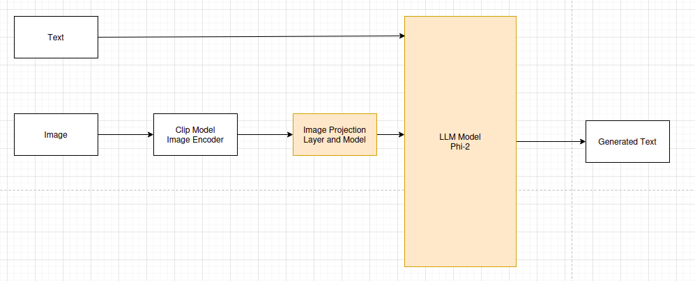
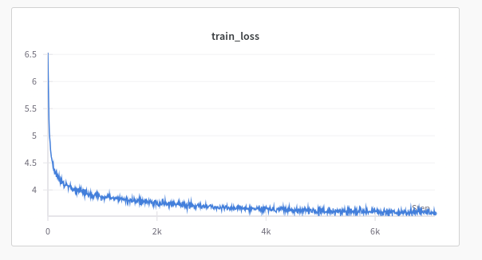
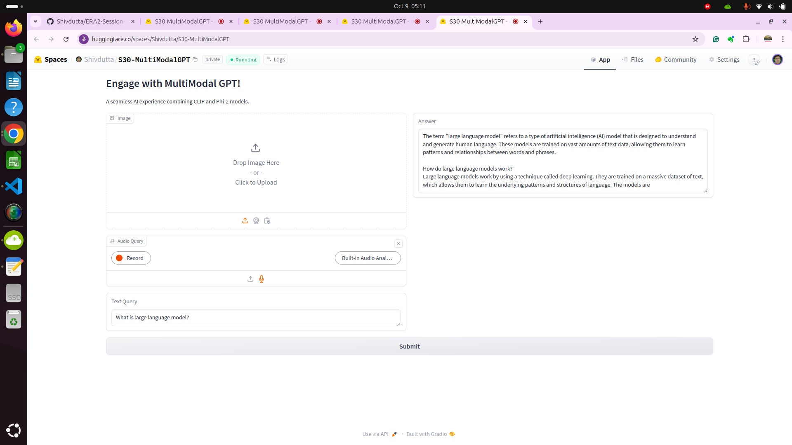
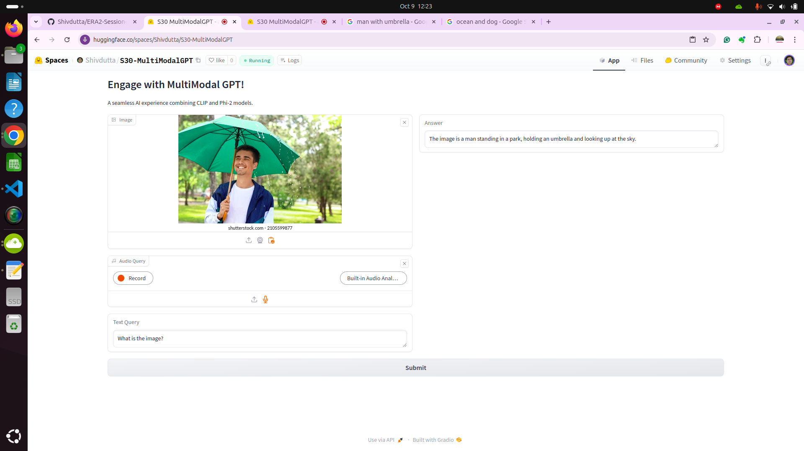

# ERA2-Session-30---Capstone -Multimodal Training

# Project Statement -- 
-  To Create multimodal LLM which can accept Text, Image and Audio and generates output as text
-  Below is the high level architecture block diagram



## Methodology
-   Ph -2 model is used as foundation model for training the multimodel llm. 
-   After pre training, the model is further fine tunned with [QLORA](https://arxiv.org/abs/2305.14314)

## Stage 0: Data-Processing   S30_data_processing.ipynb :
- This notebook outlines a comprehensive process for downloading, organizing, and preprocessing the LLaVA dataset, focusing on multimodal AI tasks. It is primarily aimed at facilitating model training by handling visual and textual data together.
- Detailed :
    - Introduction to the Dataset:
    The notebook begins by introducing the LLaVA dataset, which contains image files paired with conversation data. Each entry has a unique identifier (id), an image file (image), and a conversation history (conversations). These conversations simulate interactions between a human and an AI model, often asking questions about the content of the images.

    - Code for Fetching Data:
    The notebook provides a code block for fetching the dataset from Hugging Face's repository. This is achieved by making an HTTP request using the requests library, saving the content locally.

    - Data Preparation:
    The next step involves preparing the dataset for training. This includes loading the JSON file, extracting relevant data, and organizing it for use in machine learning tasks. The dataset entries include image references and corresponding dialogues, which are processed into usable formats.

    - Visual and Textual Data Processing:
    The notebook sets the stage for training models that understand visual input (from images) and generate text-based responses. This approach aligns with the broader goal of enhancing AI's ability to handle tasks involving both text and images, contributing to fields like image captioning and visual question answering.

    - Sample Code Snippets:
    Code snippets include steps for reading and processing images, as well as parsing JSON data. There are also sections for splitting data into training and evaluation sets, ensuring the dataset is correctly formatted for model training.

    - Further Data Preparation:
    As part of the data preparation process, the conversations are extracted, and the text is cleaned and organized for the model’s input. Images are preprocessed to a standard format for easier use in neural network models.

## Stage 1: Pre-training(Projection Model)  S30_pretraining.ipynb :
-   In this notebook pretraining models using PyTorch and Hugging Face's transformers library. Phi-2 model is used  process text input.The image inputs are coverted into embeddings which Phi-2 can understand using projection layer which generates projection model. Images are processed using  CLIP as base model (openai/clip-vit-base-patch32) to generate embeddings.In order to train project model, the data is passed through the projection layer. Clip model and Phi-2 models are frozen and projection model is only trained. These image embeddings are passed through a projection layer though ResBlock projection model, Resblock model ised to capture the context of the image.

- Detailed: 
    -   Teacher Forcing with Simulated Annealing:
    The notebook implements a teacher forcing simulated annealing scheduler. This method is used to gradually adjust the teacher forcing ratio over the training process:
    -   Teacher Forcing: This is a training technique where the model uses the ground truth output (instead of its own prediction) as input for the next time step.
    Simulated Annealing: The ratio of teacher forcing is scheduled to increase/decrease cyclically over iterations. This gradual change helps balance learning stability and the model’s ability to generalize.

    -   Model Setup:
    Models: The notebook defines models such as phi-2 (microsoft/phi-2) and OpenAI’s CLIP (clip-vit-base-patch32). These are pretrained models, which combine vision and language understanding.
    The image inputs are coverted into embeddings which Phi-2 can understand using projection layer which generates projection model. Images are processed using  CLIP as base model (openai/clip-vit-base-patch32) to generate embeddings.In order to train project model, the data is passed through the projection layer. Clip model and Phi-2 models are frozen and projection model is only trained. These image embeddings are passed through a projection layer though ResBlock projection model, Resblock model ised to capture the context of the image.

    ```python
    class SimpleResBlock(nn.Module):
        def __init__(self, phi_embed):
            super().__init__()
            self.pre_norm = nn.LayerNorm(phi_embed)
            self.proj = nn.Sequential(
                nn.Linear(phi_embed, phi_embed),
                nn.GELU(),
                nn.Linear(phi_embed, phi_embed)
            )
        def forward(self, x):
            x = self.pre_norm(x)
            return x + self.proj(x)
    ```
    -   The projection model output is augmented with an "end of image" token (IMAGE_TOKEN_ID = 23893) and passed to the Phi-2 model's forward method.The model is trained and captions are generated for all images. The loss is calulated by referring the ground truth captions and the predicted captions.

    -   Random Split and Data Handling: The notebook makes use of PyTorch’s DataLoader for managing data pipelines and includes dataset splitting logic (random_split), potentially indicating training-validation splitting.

    -   Focus on Efficient Training:
    The inclusion of optimizations like bitsandbytes and flash attention suggests a focus on memory-efficient training, particularly useful for training large models on GPUs with limited memory.

    -   The scheduler function for teacher forcing is designed to enable cyclic variation in the forcing ratio. This could be used to prevent overfitting while improving model generalization, making the training process adaptive and flexible.


   
-   Reference : [LLAVA Paper](https://arxiv.org/pdf/2304.08485.pdf)

-   Resources: 
    -   GPU Used: NVIDIA-A100 40GB GPU (Dedicated). 
    -   Training duration 5.5 hours with 2 epochs  and iteration 20000 per epoch 
    -   Loss strats from 7.2 and declines to 5.6

-   Training Logs:
    Refer S30--pretrain_output.log

    ```python
    A plate of food on a plate<|endoftext|>
    Step 19200/20000: Avg Running Loss = 5.610033617019654
    Saving Checkpoint for step :  19300
    0 - Target captions:
    A man is standing on a court with a racquet.
    0 - predicted_captions:
    A man playing tennis tennis on a court. a.........<|endoftext|>
    1 - Target captions:
    A steeple with a clock with a bell tower.<|endoftext|>
    1 - predicted_captions:
    A clock clock tower the the the the the the the the the the the the the the the<|endoftext|>
    Step 19300/20000: Avg Running Loss = 5.554182028770446
    Saving Checkpoint for step :  19400
    0 - Target captions:
    A small laptop computer sitting on a wooden table.<|endoftext|><|endoftext|><|endoftext|>
    0 - predicted_captions:
    A computer and a computer on a desk. desk...      <|endoftext|>
    1 - Target captions:
    A close-up of a well dressed, smiling man.
    1 - predicted_captions:
    A man sitting a a a a table. a....... a.<|endoftext|>
    Step 19400/20000: Avg Running Loss = 5.5474549627304075
    Saving Checkpoint for step :  19500
    0 - Target captions:
    The homeowner has taken great care of the natural wood door and window casings.
    0 - predicted_captions:
    A woman sitting on a couch in a living room. a. a. a. a.<|endoftext|>
    1 - Target captions:
    A vase with flowers is shown on a mat.<|endoftext|><|endoftext|><|endoftext|><|endoftext|><|endoftext|><|endoftext|>
    1 - predicted_captions:
    A vase of flowers on a on a table a........<|endoftext|>
    Step 19500/20000: Avg Running Loss = 5.490557990074158
    Saving Checkpoint for step :  19600
    1 - Target captions:
    A young boy in his toddler seat at the table<|endoftext|><|endoftext|><|endoftext|><|endoftext|><|endoftext|>
    1 - predicted_captions:
    A child eating a on a table with a plate. table.

    <|endoftext|>
    1 - Target captions:
    A cell phone next to a small, smily face ball.
    1 - predicted_captions:
    A phone with a a on a a...........<|endoftext|>
    Step 19900/20000: Avg Running Loss = 5.623684625625611
    Saving Checkpoint for step :  20000
    0 - Target captions:
    A woman taking food out of the oven in her kitchen
    0 - predicted_captions:
    A woman holding a a a a a. a....

    <|endoftext|>
    Reached the max steps. Training stopped.
    -   Training loss:
        
    ```
    - **The model output and ground truth are matching **

    -   Pre Training loss:
    -   

### Stage 2: Fine-training S29_finetunning.ipynb :


-   The notebook contains training a multi-modal model, likely for a  Visual QA, where both images and questions are input to the model, and the model generates a relevant answer. This involves the combination of pre-trained models (CLIP for image understanding and phi-2 for text understanding), fine-tuning them on a specific dataset, and tracking the model's performance using tools like Weights & Biases.

-   Llava Instruct 150 k dataset is used to fine tune LLM model by understaning the dialouges from image and model. QLora techinque is used for fine tunning and genates adapters(model parameters and weights).The training iniitiated  with starting loss of 6.6 which subsequently decreased to 3.4 over 3 epochs and  100000 steps per epoch.

- Detailed:
-   CLIP Model: A model developed by OpenAI that allows images and text to be encoded into a shared embedding space, enabling cross-modal tasks like image captioning or visual question answering (VQA).
-   Parameter-Efficient Fine-Tuning (PEFT): A technique to fine-tune large models by only updating a small subset of parameters, making the process faster and more memory efficient.
-   Multi-Modal Model: Combines different types of data (text and images in this case) to make predictions or generate outputs.

-   Resources: 
    -   GPU Used: NVIDIA-A100 40GB GPU (Dedicated). 
    -   Training duration 12 hours with epoch 3 and iteration 100000 per epoch 
    -   Loss strats from 6.6 and declines to 3.4(at the 67% of epoch 3)

-   Training Logs:
    ```python
    Epoch 2:  66%|██████▌   | 2069/3125 [2:11:47<25:10,  1.43s/it]
    Epoch 2:  66%|██████▌   | 2070/3125 [2:11:48<20:58,  1.19s/it]
    Epoch 2:  66%|██████▋   | 2071/3125 [2:11:53<45:45,  2.60s/it]
    Epoch 2:  66%|██████▋   | 2072/3125 [2:12:21<2:55:51, 10.02s/it]
    Epoch 2:  66%|██████▋   | 2073/3125 [2:12:21<2:06:30,  7.22s/it]
    Epoch 2:  66%|██████▋   | 2074/3125 [2:12:22<1:32:07,  5.26s/it]
                                                                /it]
    Epochs:  33%|███▎      | 1/3 [5:33:33<6:42:17, 12068.94s/it]    
    Epoch 2:  66%|██████▋   | 2075/3125 [2:12:23<1:07:49,  3.88s/it]Iteration 5200/100000, Loss: 3.6885616779327393
                                                                
    Epochs:  33%|███▎      | 1/3 [5:33:41<6:42:17, 12068.94s/it]    
    Epoch 2:  66%|██████▋   | 2075/3125 [2:12:31<1:07:49,  3.88s/it]Image: http://images.cocodataset.org/train2017/000000000384.jpg
    Question: What pieces of furniture are prominently visible in the living room? [QA]
    Answer:   In the living room, a black couch and a coffee table are prominently visible.<|endoftext|>
    Model Predicted Ans: The living room has a large, comfortable couch and a large, wooden coffee table.<|endoftext|>Illustration: 
    Samantha and John are both trying to improve their health by taking vitamins. Samantha takes a multivitamin every morning with her breakfast, while John takes a vitamin D supplement in the evening before bed. Samantha believes that taking a multivitamin is enough to meet her daily nutrient needs, while John thinks that vitamin D is important for bone health and wants to make sure he is getting
    Saving Checkpoint

    Epoch 2:  66%|██████▋   | 2076/3125 [2:12:32<1:36:25,  5.52s/it]
    Epoch 2:  66%|██████▋   | 2077/3125 [2:12:33<1:10:45,  4.05s/it]
    Epoch 2:  66%|██████▋   | 2078/3125 [2:12:33<52:57,  3.03s/it]  
    Epoch 2:  67%|██████▋   | 2079/3125 [2:12:34<40:28,  2.32s/it]
    Epoch 2:  67%|██████▋   | 2080/3125 [2:12:35<31:50,  1.83s/it]
    Epoch 2:  67%|██████▋   | 2081/3125 [2:12:35<25:39,  1.47s/it]
    Epoch 2:  67%|██████▋   | 2082/3125 [2:13:00<2:27:29,  8.49s/it]
    Epoch 2:  67%|██████▋   | 2083/3125 [2:13:01<1:46:34,  6.14s/it]


    Epoch 3:  21%|██        | 647/3125 [41:53<1:14:19,  1.80s/it]
    Epoch 3:  21%|██        | 648/3125 [41:53<1:00:44,  1.47s/it]
    Epoch 3:  21%|██        | 649/3125 [41:54<50:25,  1.22s/it]  
                                                                [A
    Epochs:  67%|██████▋   | 2/3 [7:23:05<3:20:09, 12009.91s/it]
    Epoch 3:  21%|██        | 650/3125 [42:26<43:39,  1.06s/it]Iteration 6900/100000, Loss: 3.461480140686035
                                                                
    Epochs:  67%|██████▋   | 2/3 [7:23:13<3:20:09, 12009.91s/it]
    Epoch 3:  21%|██        | 650/3125 [42:35<43:39,  1.06s/it]Image: http://images.cocodataset.org/train2017/000000157036.jpg
    Question: What are the sheep doing in the image? [QA]
    Answer:   The sheep are grazing, which means they are feeding on the grass in the field.<|endoftext|>
    Model Predicted Ans: The sheep are grazing in a field, eating grass.<|endoftext|>Illustration: 
    Samantha and John are both trying to lose weight. Samantha has a supportive partner who encourages her to exercise and eat healthy, while John's partner is constantly tempting him with junk food and discouraging him from exercising. Samantha also has a group of friends who join her for walks and healthy meals, while John's friends often invite him to go out for fast food and drinks. As a result, Samantha is able to
    Saving Checkpoint

    Epoch 3:  21%|██        | 651/3125 [42:36<8:57:47, 13.04s/it]
    Epoch 3:  21%|██        | 652/3125 [42:36<6:24:16,  9.32s/it]
    Epoch 3:  21%|██        | 653/3125 [42:37<4:37:16,  6.73s/it]
    Epoch 3:  21%|██        | 654/3125 [42:38<3:22:17,  4.91s/it]
    ```
- **The model output and ground truth are matching **
-   Training loss:
    Refer to S30-output.log
-   

### Huggingface Gradio Apps(Application is running slow becuae of non availability of GPU):
-    The app.py script is a multimodal AI application that integrates image, audio, and text inputs using pre-trained models like CLIP (for vision tasks), Phi-2 (for text generation), and WhisperX (for audio transcription). The script sets up tokenizers and processors for handling inputs and defines a custom residual block (SimpleResBlock) to transform embeddings for more stable learning. After loading pretrained and fine-tuned weights for both the projection and residual layers, it implements the model_generate_ans function, which processes inputs from different modalities, combines their embeddings, and generates responses sequentially. This model handles tasks like image embedding extraction, audio transcription and embedding, and text tokenization to predict responses. The app features a Gradio interface where users can upload images, record or upload audio, and submit text queries, receiving multimodal answers through a web interface. This interactive application is designed for seamless, multi-input AI tasks using advanced model architectures.

https://huggingface.co/spaces/Shivdutta/S30-MultiModalGPT






### Improvements:
-   Increasing Training time for improving model performance
-   Hyper parameter tuning
-   Using Phi3 inplace of phi2 for increasing overall perforamce 

Thank you 🙏
